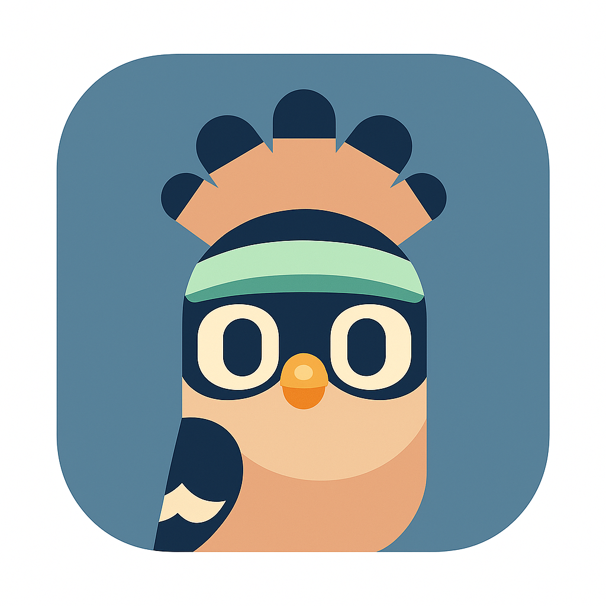
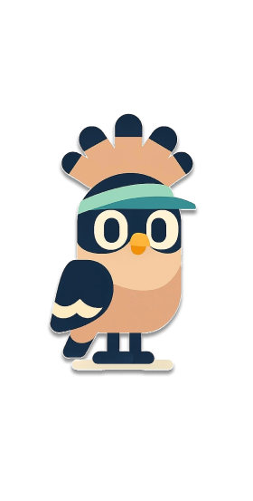

# ANIS - Sports Activity Platform

<div align="center">
  
  <br/>
  
  
  **Connect. Play. Thrive.**
  
  *Meet ANIS انيس , your sports companion! ANIS brings athletes together to discover, create, and join sports activities in their community.*
</div>

## 🏆 The Idea Behind ANIS

**ANIS** was born from a simple yet powerful idea: *What if finding the perfect sports partner or group was as easy as opening an app?* 

In a world where people often struggle to find others who share their passion for sports, ANIS creates a bridge between athletes of all levels. Whether you're a beginner looking to learn tennis, an intermediate player seeking a volleyball team, or an advanced footballer wanting competitive matches, ANIS connects you with the right people at the right time.

Our mascot, **Hoopoe** 🐦, represents the spirit of connection and community that drives our platform. Just as the Hoopoe bird is known for bringing messages and connecting distant places, ANIS brings together athletes who might never have met otherwise.

This location-based sports networking platform was developed as part of the **Apple Developer Academy Summer Foundation Program**, showcasing modern iOS development practices and the beautiful liquid glass UI design that makes every interaction feel magical.

## ✨ Features

### 🗺️ Interactive Map Experience
- **Real-time Activity Discovery**: Browse sports activities on an interactive map
- **Location-based Search**: Find activities near you or in specific areas
- **Activity Pins**: Visual markers showing sport type, skill level, and availability
- **Liquid Glass Design**: Beautiful frosted glass effects throughout the interface

### 🏃‍♂️ Activity Management
- **Create Activities**: Host your own sports sessions with custom details
- **Join Activities**: Request to join activities that match your interests
- **Skill Level Matching**: Find players at your experience level (Beginner, Intermediate, Advanced)
- **Real-time Updates**: Live updates on participant counts and activity status

### 👤 Social Profiles
- **Personal Profiles**: Showcase your sports interests and experience
- **Social Integration**: Connect via Instagram, WhatsApp, and X (Twitter)
- **Profile Customization**: Edit your information and preferences
- **Join Requests**: Manage incoming requests to your activities

### 🎯 Sports Categories
- **Padel** 🏓
- **Football** ⚽
- **Tennis** 🎾
- **Volleyball** 🏐
- **Basketball** 🏀

## 📱 Design Philosophy

ANIS embraces Apple's **liquid glass UI style** with:
- Ultra-thin material effects and frosted glass surfaces
- Smooth animations and micro-interactions
- Accessibility-first design with reduced motion support
- Consistent color palette inspired by the app mascot
- Modern typography and spacing following Human Interface Guidelines

## 🛠️ Technical Architecture

### **Built With**
- **SwiftUI** - Modern declarative UI framework
- **MapKit** - Interactive maps and location services
- **Core Location** - GPS and location permissions
- **Combine** - Reactive programming for data flow
- **MVVM Architecture** - Clean separation of concerns

### **Key Components**
- **Models**: Core data structures (Activity, User, JoinRequest)
- **ViewModels**: Business logic and state management
- **Views**: Modular, reusable UI components
- **Services**: Mock data service (ready for backend integration)
- **Utils**: Constants, themes, and utility functions

### **Mock Data Implementation**
Currently uses a comprehensive mock data service for development and testing, designed for easy transition to a real backend when ready.

## 🚀 Development Process

This project was developed using modern iOS development practices and tools:

- **Xcode & SwiftUI**: Primary development environment for iOS app creation
- **Git Version Control**: Systematic tracking of development progress
- **Cursor AI Assistant**: Used as a development assistant to accelerate coding, provide architecture suggestions, and maintain code quality throughout the project

The development process emphasized clean architecture, accessibility, and following Apple's Human Interface Guidelines to create a polished, professional application.

## 📸 Screenshots

*Coming Soon - Screenshots will be added showcasing the beautiful liquid glass interface and key features.*

## 🏗️ Project Structure

```
ANIS/
├── ANISApp/
│   ├── Models/          # Data models and structures
│   ├── ViewModels/      # Business logic and state
│   ├── Views/           # SwiftUI view components
│   │   ├── Main/        # Core app screens
│   │   └── Onboarding/  # Welcome flow
│   ├── Services/        # Data services and APIs
│   ├── Utils/           # Constants and utilities
│   └── Assets.xcassets/ # Images and icons
├── ANISTests/           # Unit tests
└── ANISUITests/         # UI automation tests
```

## 🎓 Apple Developer Academy

This project represents the culmination of learning and development skills acquired through the **Apple Developer Academy Summer Foundation Program**. The program provided invaluable insights into:

- iOS app development best practices
- Swift and SwiftUI mastery
- User experience design principles
- Accessibility and inclusivity in app design
- Modern development workflows and tools

## 🔧 Getting Started

### Prerequisites
- Xcode 15.0+ 
- iOS 17.0+ deployment target
- macOS 14.0+ for development

### Installation
1. Clone the repository:
   ```bash
   git clone https://github.com/yourusername/ANIS.git
   ```
2. Open `ANIS.xcodeproj` in Xcode
3. Build and run on your device or simulator

### Development Mode Features
- **Triple-tap reset**: Reset app state during development
- **Debug builds**: Automatic state reset on each run
- **Mock data**: Full feature testing without backend

## 🌟 Future Roadmap

- [ ] Real-time chat integration
- [ ] Push notifications for activity updates
- [ ] Advanced filtering and search
- [ ] Achievement and ranking system
- [ ] Weather integration
- [ ] Backend API integration
- [ ] Android version

## 🤝 Contributing

This project was developed as part of an educational program. For questions or feedback, please reach out through the contact information in the app.

## 📄 License

This project is part of the Apple Developer Academy program and follows their guidelines and policies.

---

<div align="center">
  <p><strong>Built with 💚 at Apple Developer Academy</strong></p>
  <p><em>Connecting athletes, one activity at a time.</em></p>
</div>
